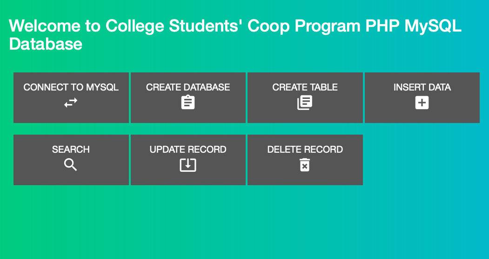
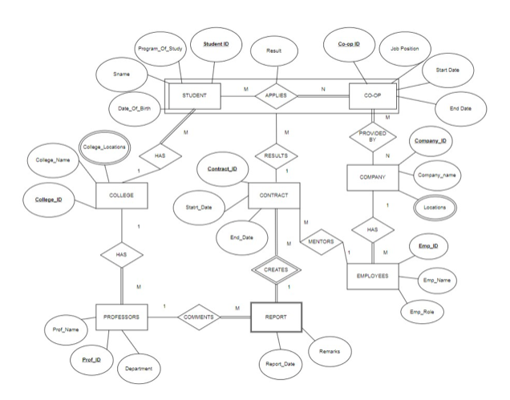
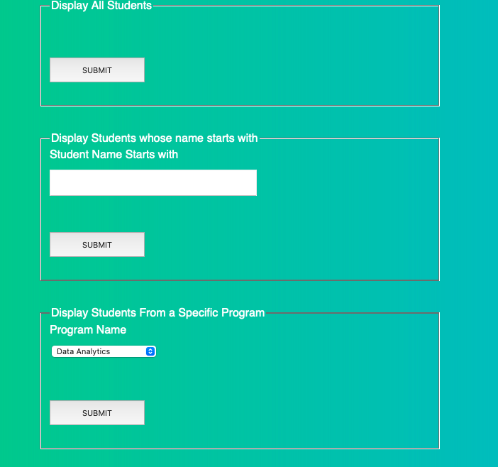

# University & COOP Students Database

## Table of Contents
1. [Project Overview](#project-overview)
2. [Project Files](#project-files)
3. [Project Overview](#overview)
3. [How to Run](#how-to-run)
4. [Steps](#steps)
5. [Results](#results)
6. [Acknowledgements](#acknowledgements)

## Overview
This project aims to create a comprehensive database to manage the co-op programs for students at a college. The database is designed to handle various entities and relationships involved in the co-op process, including students, companies, co-op positions, application statuses, advisors, mentors, and report schedules.

### Key Features
- **Student Information Management**: Stores details about students such as name, date of birth, program of study, and registration date.
- **Company and Position Data**: Keeps records of companies offering co-op positions and the specifics of these positions.
- **Application Tracking**: Records application details, including submission dates and outcomes (accepted or rejected).
- **Advisor and Mentor Assignments**: Manages the assignment of advisors and mentors to students, along with their interactions.
- **Report Schedules and Submissions**: Tracks the deadlines for report submissions and the actual submission dates by students.

### Assumptions
- Only a subset of students will participate in co-op programs (partial participation).
- Every co-op program will have at least one student (total participation).
- A student can join only one co-op program, but a co-op program can include many students (1:M relationship).
- Companies can offer multiple co-op programs, and a single co-op program can involve multiple companies (M:N relationship).
- Every co-op program is associated with at least one company (total participation), but not all companies necessarily offer co-op programs (partial participation).
- Each student is assigned one mentor, while a mentor can guide multiple students (1:M relationship).
- Each student has one advisor, and an advisor can oversee multiple students (1:M relationship).
- A faculty can include many advisors, with each advisor being part of one faculty (1:M relationship).

### Solution Approach
The database schema was designed following normalization principles to avoid redundancy and ensure data integrity:
- **Relational Schema**:
  - **Entities**:
    - `Student(Student_ID, Date_of_Birth, SName, Program_of_Study)`
    - `College(College_ID, College_Name)`
    - `Professors(Prof_ID, Prof_Name, Department, College_ID)`
    - `Contract(Contract_ID, Start_Date, End_Date, Student_ID, Co-op_ID, Emp_ID)`
    - `Employees(Emp_ID, Emp_Name, Emp_Role, Company_ID)`
    - `Co-op(Co-op_ID, Job_Position, Start_Date, End_Date, Student_ID)`
    - `Company(Company_ID, Company_Name)`
  - **Weak Entities**:
    - `Report(Contract_ID, Prof_ID, Remarks, Report_Date)`
  - **Many-to-Many Relations**:
    - `Student_AppliesFor_Coop(Co-op_ID, Student_ID, Result)`
    - `Company_Provide_Coop(Co-op_ID, Company_ID)`

- **Normalization**:
  - To eliminate null values and enhance efficiency, separate tables were created for attributes with multiple values:
    - `Company_Location(Company_ID, Location)`
    - `College_Locations(College_ID, College_Locations)`

This database system provides a structured and efficient way to manage the various aspects of co-op programs, ensuring accurate and accessible data for all stakeholders involved.

## Project Files
1. [index.html]
2. [css]
3. [html-files]
4. [php-files]

## How to Run

This guide provides basic steps to get your database project running using WampServer. 

This project involves MySQL, PHP, HTML, and CSS. Follow these instructions to set up and run the project locally using WampServer.

### Prerequisites

1. **WampServer**: Download and install from [WampServer's official website](http://www.wampserver.com/en/).
2. **Web Browser**: Any modern web browser.
3. **Text Editor**: Any text editor for editing configuration files. 

### Installation Steps

1. **Start WampServer**:
    - Launch WampServer and ensure the icon in the notification area is green, indicating all services are running.

2. **Configure phpMyAdmin**:
    - Open phpMyAdmin from the WampServer menu.
    - Login with the default username `root` and no password.

3. **Set Up Your Project**:
    - Place your project files (PHP, HTML, CSS) in the `www` directory of your WampServer installation.

4. **Create and Configure the Database**:
    - In phpMyAdmin, create a new database for your project.
    - Update your project's configuration file with the database details.

5. **Access Your Project**:
    - Open your web browser and navigate to `http://localhost/university-student-db`.

For detailed instructions and troubleshooting, refer to the WampServer documentation or visit the [WampServer support forum](http://forum.wampserver.com/list.php?2).

---

## Results

## Acknowledgement
- Douglas College for the comprehensive Data Analytics program.
- Special thanks to Saeed Mirjalili for the documentation and detailed teaching including ER-EER diagrams, MySQL and PHP database and programming languages.